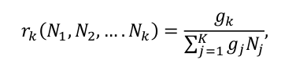
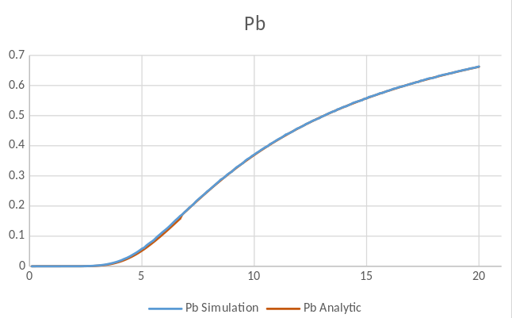
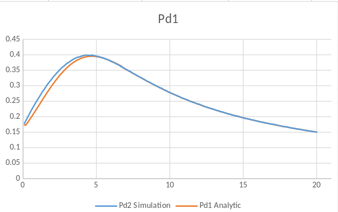
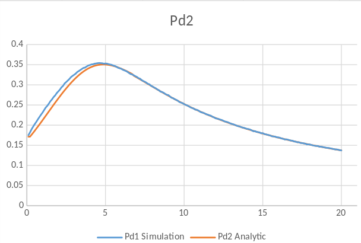
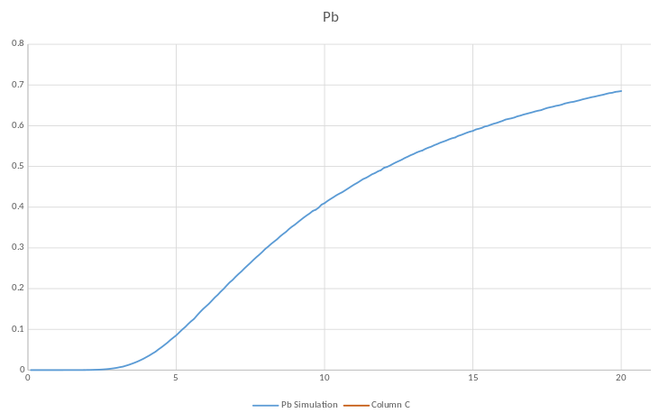
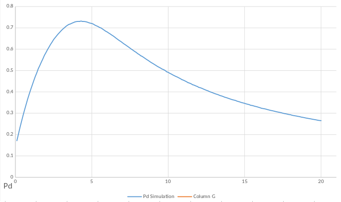
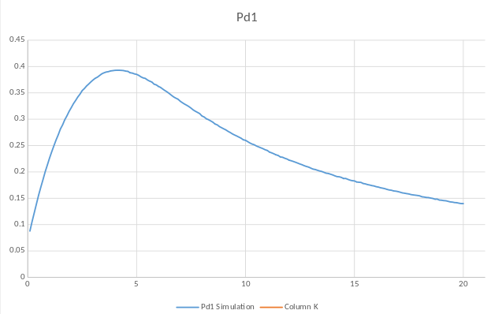
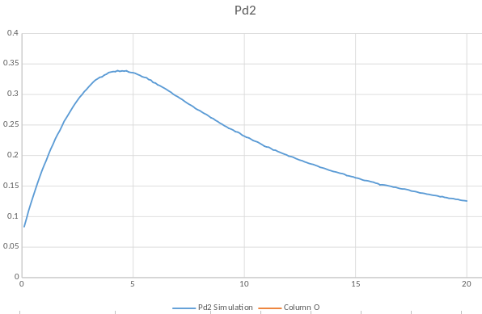

# Simulation of M/M/1/K Queue with a Discriminatory Processor Sharing Service Order
My 3rd project was in the "Performance Evaluation of Computer Systems" course when I was in the 3rd semester of my master's at SUT. In this project, I simulated an M/M/1/K queue(length = 12) with a Discriminatory Processor Sharing Service Order and compared its results with analytical predifined results. There are two assumptions for the waiting time function (Theta), Fixed and Exponential. In sum, this simulation gives us The possibility of blocked requests(P_b) and the possibility of missed deadline requests(P_b).

## Service-time ratio

|  | 
|:--:| 
| *01* |

## Simulation Results

The system was simulated under 10 Million customer requests for Lambda in [0.1,20] intervals with a jump of 0.1 unit.

###### P_b Diagram for Exponential Waiting Time

|  | 
|:--:| 
| *02* |

###### P_d Diagram for Exponential Waiting Time

|  | 
|:--:| 
| *03* |

###### P_d of Type 1 requests Diagram for Exponential Waiting Time

|  | 
|:--:| 
| *04* |

###### P_d of Type 2 requests Diagram for Exponential Waiting Time

|  | 
|:--:| 
| *05* |

###### P_b Diagram for Fixed Waiting Time

|  | 
|:--:| 
| *06* |

###### P_d Diagram for Fixed Waiting Time

|  | 
|:--:| 
| *07* |

###### P_d of Type 1 requests Diagram for Fixed Waiting Time

|  | 
|:--:| 
| *08* |

###### P_d Type 2 requests Diagram for Fixed Waiting Time

|  | 
|:--:| 
| *09* |
