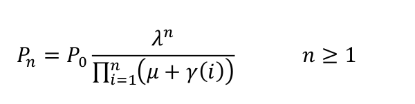
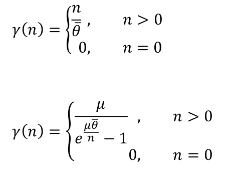
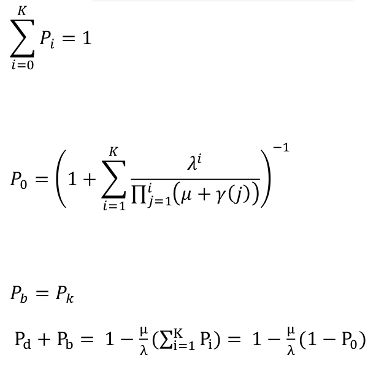
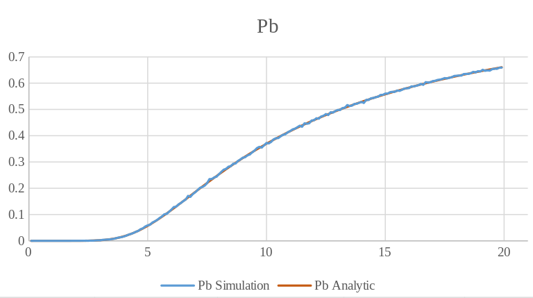
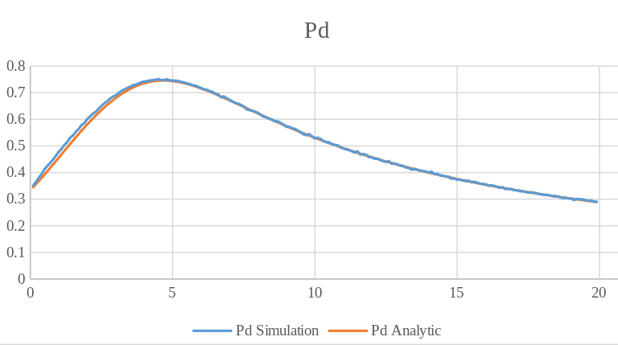
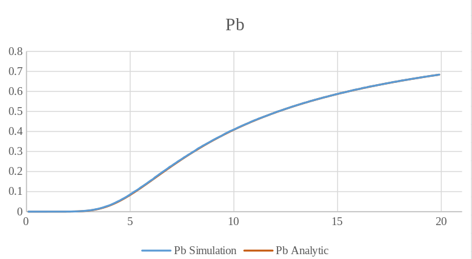
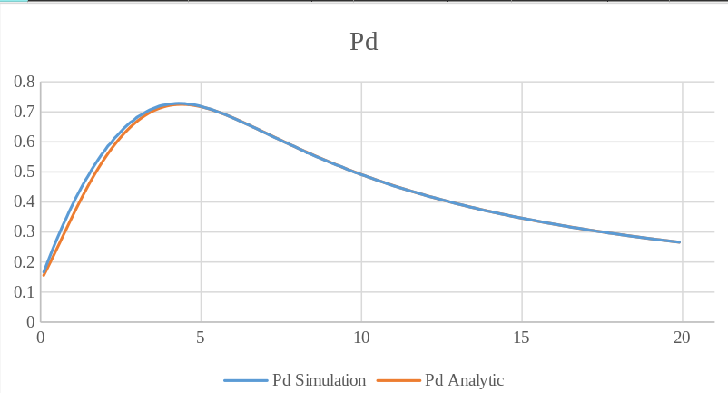

# Simulation of M/M/1/K Queue with an a Processor Sharing Service Order

My 2nd project was in the "Performance Evaluation of Computer Systems" course when I was in the 3rd semester of my master's at SUT. In this project, I simulated an M/M/1/K queue(length = 12) with aa Processor Sharing Service Order and compared its results with analytical methods. There are two assumptions for the waiting time function (Theta), Fixed and Exponential. In sum, this simulation gives us The possibility of blocked requests(P_b) and the possibility of missed deadline requests(P_b).

## Analytical formulas

|  | 
|:--:| 
| *01* |

|  | 
|:--:| 
| *02* |

|  | 
|:--:| 
| *03* |

## Simulation Results

The system was simulated under 10 Million customer requests for Lambda in [0.1,20] intervals with a jump of 0.1 unit.

###### P_b Diagram for Exponential Waiting Time

|  | 
|:--:| 
| *06* |

###### P_d Diagram for Exponential Waiting Time

|  | 
|:--:| 
| *07* |

###### P_b Diagram for Fixed Waiting Time

|  | 
|:--:| 
| *08* |

###### P_d Diagram for Fixed Waiting Time

|  | 
|:--:| 
| *09* |
